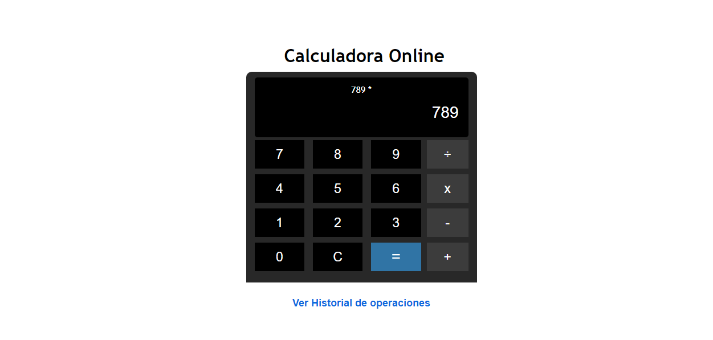
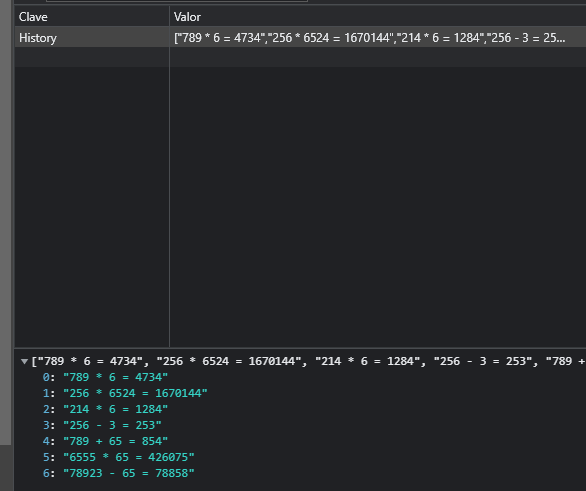
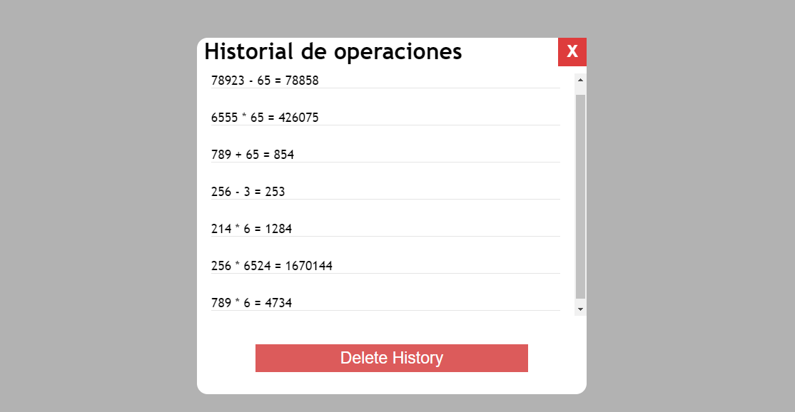

# Tarea 2 programacion Web

Esta es mi tarea 2 de programación web

- Mi nombre es Bryan Xavier Florentino Montero
- Mi matrícula es : 2020-10674

## Título de la tarea

Haga una calculadora con HTML5 , JavaScript (ES5) adornada con CSS3, la cual
debe hacer las operaciones básicas de suma, resta, multiplicación y división la cual
almacene un historial de los cálculos hechos hasta que el usuario decida eliminarlos.

Utilice la funcionalidad de localStorage para guardar el historial de las operaciones
realizadas.

## Capturas de pantalla

